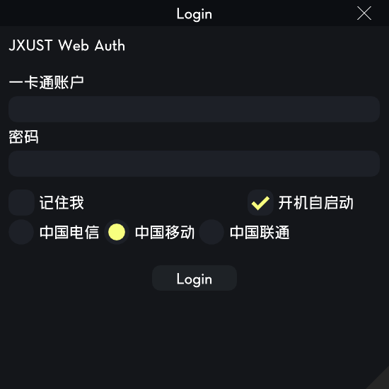

# 江西理工大学校园网自动登录程序

本项目是一个基于 C++ 和 ImGui 构建的 Windows 桌面应用程序，旨在为江西理工大学的学生和教职工提供一个方便、快捷的校园网自动登录解决方案。
## UI预览


## ✨ 功能特性

- **图形用户界面**：采用 Dear ImGui 构建，界面简洁美观，易于操作。
- **自动认证**：程序启动后会自动检测网络连接并尝试进行登录认证。
- **配置持久化**：支持“记住我”功能，可将您的登录信息（一卡通账户、密码、运营商）加密保存在本地配置文件中，免去重复输入的烦恼。
- **开机自启动**：提供开机自启动选项，设置后程序将在您每次开机时自动运行，实现无感知的校园网登录体验。
- **运营商支持**：支持中国电信、中国移动、中国联通三家运营商的校园网套餐。
- **轻量高效**：程序体积小，资源占用低，运行稳定。

## 🚀 如何使用

### 1. 下载

您可以从本项目的 [Releases](https://github.com/TokiHanako/JXUST_Auth/releases) 页面下载最新的已编译版本。

### 2. 运行

下载后，双击运行 `JXUST.exe` 即可。

### 3. 配置

- **一卡通账户**：输入您的学号或工号。
- **密码**：输入您的校园网登录密码。
- **记住我**：勾选此项后，您的登录信息将被保存，下次启动时会自动填充。
- **开机自启动**：勾选此项后，程序将被添加到系统启动项，实现开- 机自动登录。
- **选择运营商**：根据您办理的校园网套餐选择对应的运营商。

配置完成后，点击“Login”按钮即可登录。

## 🛠️ 如何编译 (面向开发者)

本项目使用 CMake+Ninja 进行构建，使用 ndk29的clang19 进行编译。

### 1. 克隆仓库

```bash
git clone https://github.com/TokiHanako/JXUST_Auth.git
cd JXUST_Auth
```

### 2. 编译

您可以使用 vscode 打开本项目，通过以下命令进行编译：

```bash
mkdir build
cd build
cmake ..
ninja
```

编译后的可执行文件位于 `build`目录下。

## 🤝 贡献

欢迎您为本项目贡献代码或提出改进建议！您可以通过以下方式参与：

- **提交 Issue**：如果您在使用过程中遇到任何问题或有新的功能建议，欢迎提交 Issue。
- **发起 Pull Request**：如果您修复了 Bug 或实现了新功能，可以直接发起 Pull Request。

## 📄 许可

本项目采用 [MIT License](LICENSE) 开源许可。
